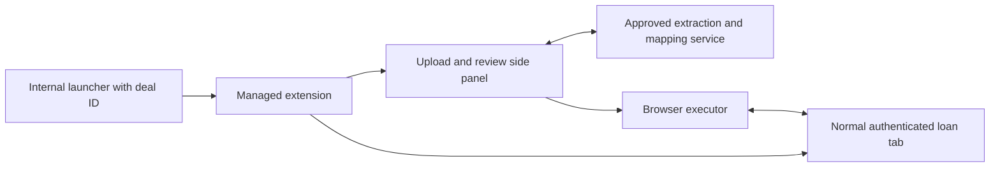

# Research: form filling in the user's browser

Date: 2026-09-10. Status: researched feasibility and proposed direction; no implementation or performance benchmark. Primary documentation and selected upstream source were inspected. Internal application behavior was not tested. This supersedes the architectural baseline in [the September 8 report](./research-form-filling-approaches.md).

## Conclusion

Removing Electron and Playwright is feasible. With the target application unchanged, the strongest approach is a browser extension (optionally enterprise-managed) with an upload/review side panel and an executor attached to the actual loan application tab. A separate-origin web app containing an iframe cannot independently control the iframe's fields.

Two candidates deserve a focused comparison: Puppeteer Core inside an extension for browser-level interaction, and Alibaba Page Agent's browser-resident DOM controller for a lighter executor. Neither has demonstrated equivalent accuracy or speed on the internal forms. That is a validation question, not a property established by a project description.

The user accepts a browser side panel and is open to an extension if its trade-offs justify it. The existing user browser is required; no separate Chromium instance is allowed. Documents and deal information must not be retained by the filler. Action metadata may be logged without deal information. Debugger feasibility remains an environment check. No architecture ADR is accepted yet.

## Corrected requirements

- Internal application: Playwright **1.49**. The separate Fillet Bros repository pins **1.62.1** in `packages/driver-playwright/package.json`; it is not the internal deployment.
- Generated production fill plans are **never committed**. Production data must not be committed anywhere. This research contains no production payloads or generated production plans.
- Influence over the internal application is possible, but source changes, new DOM hooks, and cooperative integration are out of scope now. Runtime interaction with existing controls is necessary for any filling approach.
- Drift is rare and unannounced. Frequent redesign is not the motivating problem.
- Per-step planning/mapping takes about five seconds; extraction on the same document has similar timing. Optimizing either is not the objective.
- Research is greenfield. Reusing the current repo is optional.
- Historical context suggests Angular, custom searchable dropdowns, AG Grid, SSO, PDF/Outlook inputs, and human submission. These guide evaluation examples; they are not independently verified facts about every current internal form.

The earlier durable-plan/replay recommendation is not a prerequisite. Fresh, transient plans on every step remain viable. The user clarified that the filler must not save documents or deal information. Extraction and fill plans are transient; payload-free action metadata may be logged to trace user actions. This restriction concerns copies made by the filler, not the intended entry of values into the loan application.

## Why the iframe idea has a boundary

Three separate checks apply:

1. **Embedding:** the loan app can refuse framing through CSP `frame-ancestors` or `X-Frame-Options`. An extension's host permissions do not by themselves remove this restriction. [CSP framing](https://developer.mozilla.org/en-US/docs/Web/HTTP/Reference/Headers/Content-Security-Policy/frame-ancestors).
2. **DOM access:** even if the iframe renders, a parent at a different origin cannot inspect or fill its document. Same organization or sibling subdomains do not establish same origin; scheme, host, and port matter. CORS response headers do not grant cross-origin iframe DOM access. [Same-origin policy](https://developer.mozilla.org/en-US/docs/Web/Security/Defenses/Same-origin_policy), [iframe contentWindow](https://developer.mozilla.org/en-US/docs/Web/API/HTMLIFrameElement/contentWindow).
3. **Authentication:** cross-site framing introduces cookie and storage behavior that can differ from a normal top-level session. Actual SSO behavior must be tested. [Cookies](https://developer.mozilla.org/en-US/docs/Web/HTTP/Guides/Cookies), [extension storage and cookies](https://developer.chrome.com/docs/extensions/develop/concepts/storage-and-cookies).

A pure web app can work if its controller and target genuinely share an origin, embedding is allowed, and sandbox flags do not block access. A cooperative `postMessage` bridge is another option, but the target must implement the handler. Neither condition has been established here. A reverse proxy changes deployment, authentication, URL handling, and security boundaries; it is not a transparent shortcut.

A PWA changes installation and presentation, not the same-origin rule. An injected script or bookmarklet must still execute in the target context. An extension supplies that permissioned execution location without changing the application's deployed source. Content scripts share the DOM while normally keeping their JavaScript environment isolated; cross-origin child frames need their own permitted injection. [Content scripts](https://developer.chrome.com/docs/extensions/develop/concepts/content-scripts).

## Proposed user journey

1. User opens an internal launcher URL with a deal ID.
2. Launcher requests that the installed extension open or select the approved loan URL. Allowlist the launcher origin and validate the deal ID; construct the target URL from approved templates.
3. The loan app opens as a normal browser tab, using that browser profile's current authentication. Bind the run to the exact tab, document/frame, and deal identity.
4. User opens the extension side panel and uploads documents. Extraction and mapping use the approved internal service; keep provider credentials behind that service.
5. Capture current fields; generate a transient plan; resolve targets; fill through the selected executor; verify the resulting application state.
6. Mark failed or unverifiable fields as **Needs review** in the side-panel field list and continue with the next field. Once the run finishes, the user manually corrects those fields and saves the deal. The filler does not save or submit the deal.

Chrome supports allowlisted webpage-to-extension messaging. A native side panel is packaged extension content, not simply an arbitrary hosted URL. Opening it programmatically normally requires user interaction; do not promise that an incoming URL will silently open it after an asynchronous login. Its left/right placement is browser-controlled, so avoid promising an app-enforced left dock. [Messaging](https://developer.chrome.com/docs/extensions/develop/concepts/messaging), [Side Panel API](https://developer.chrome.com/docs/extensions/reference/api/sidePanel).

## Execution options

### Puppeteer Core in a browser extension

Puppeteer's documented browser bundle exposes `ExtensionTransport.connectTab(tabId)` over `chrome.debugger`. The end user needs neither a Node daemon nor a separate browser download for this execution path. Support is explicitly **experimental**. Each connection sees one page and its associated frames/workers; create tabs with `chrome.tabs`. [Official extension guide and example](https://pptr.dev/guides/running-puppeteer-in-extensions).

Puppeteer provides selectors, locators, input APIs, and waiting behavior. Its documented locator checks include visibility, enabled state, viewport positioning, and stable geometry. These reduce custom executor work but are not a promise of Playwright-equivalent strictness or actionability. Explicitly check target uniqueness and postconditions. [Puppeteer interactions](https://pptr.dev/guides/page-interactions), [Playwright actionability](https://playwright.dev/docs/actionability).

The debugger API exposes relevant CDP domains including Accessibility, DOM, Runtime, and Input. Out-of-process frames require target/session handling. Debugger access is a broader privilege than ordinary host-scoped content scripts; an application URL allowlist is not an OS/browser-enforced narrowing of that privilege. [Debugger API](https://developer.chrome.com/docs/extensions/reference/api/debugger), [permission warnings](https://developer.chrome.com/docs/extensions/reference/permissions-list).

**Assessment:** strongest starting point for a reliability-focused comparison, conditional on debugger acceptability. It removes Playwright while retaining an established interaction library. Browser APIs and versions, attachment interruption, and enterprise deployment still need testing.

### Alibaba Page Agent / PageController

[Page Agent](https://github.com/alibaba/page-agent) is MIT-licensed in-page JavaScript with a DOM-based agent and optional browser extension. It derives DOM-processing ideas from browser-use. The extension offers a webpage API for starting and stopping multi-page tasks; its documented normal-window requirement excludes PWA app windows. [Extension API](https://github.com/alibaba/page-agent/blob/main/packages/extension/docs/extension_api.md).

The particularly useful component is `@page-agent/page-controller`: it separates DOM capture and element actions from the LLM. This gives us a plausible way to retain per-step mapping through the internal service without adopting a whole autonomous agent. The controller exposes structured page state and indexed click/input/select operations. **Our integration proposal is an inference from this interface; it has not been built.** [Controller documentation source](https://github.com/alibaba/page-agent/blob/9eb6b6646500264d9034dd466a4270cb9fc1ef1e/packages/website/src/pages/docs/advanced/page-controller/page.tsx).

At inspected revision `9eb6b6646500264d9034dd466a4270cb9fc1ef1e`, the extension does not request `debugger` but does request broad host access. Input source uses native value setters and synthetic DOM events. For ordinary non-contenteditable text input, the inspected path emits `input` without completing a universal blur/commit sequence. That matters for fields configured to update on blur. [Manifest configuration](https://github.com/alibaba/page-agent/blob/9eb6b6646500264d9034dd466a4270cb9fc1ef1e/packages/extension/wxt.config.js), [actions source](https://github.com/alibaba/page-agent/blob/9eb6b6646500264d9034dd466a4270cb9fc1ef1e/packages/page-controller/src/actions.ts), [Angular update options](https://angular.dev/api/forms/NgModel).

Its own limitations list supports single-level same-origin iframes, but excludes nested/cross-origin iframes, keyboard shortcuts, drag-and-drop, and visual/canvas understanding. Opening the loan app top-level avoids the proposed outer iframe problem; embedded widgets inside that app still matter. [Limitations source](https://github.com/alibaba/page-agent/blob/9eb6b6646500264d9034dd466a4270cb9fc1ef1e/packages/website/src/pages/docs/introduction/limitations/page.tsx).

Do not test production documents with its default demo endpoint. The project explicitly prohibits sensitive data there. Configure the internal gateway, inspect history/storage paths, and avoid unrestricted JavaScript tools in a production filler. [Project data terms](https://github.com/alibaba/page-agent/blob/main/docs/terms-and-privacy.md).

**Assessment:** closest reusable in-page alternative to the browser-use idea, and a valuable second POC arm. Its DOM-only semantics and stated limitations make an accuracy claim premature.

### Plain content-script executor

A small purpose-built executor can resolve DOM targets and trigger input/change/blur or widget-specific sequences. It needs no Puppeteer, Playwright, or debugger permission. However, dispatching events produces untrusted events; setting `.value` alone does not establish that application state changed. [Event trust](https://developer.mozilla.org/en-US/docs/Web/API/Event/isTrusted), [Angular control/value bridge](https://angular.dev/api/forms/ControlValueAccessor).

**Assessment:** reasonable if a finite widget inventory passes testing. Implementing visibility, re-resolution, ambiguity detection, frame traversal, and custom-widget behavior is meaningful work. A library such as PageController may reduce it; it does not eliminate verification.

## Other open-source options screened

| Project | What it contributes | Fit for this application |
| --- | --- | --- |
| [WXT](https://wxt.dev/guide/introduction.html) | MIT extension build framework | Useful packaging and development foundation; does not supply a form executor |
| [Nanobrowser](https://github.com/nanobrowser/nanobrowser) | Apache-2.0 extension with side panel and Puppeteer browser transport | Strong architecture reference; adapt selectively |
| [Browser Use](https://github.com/browser-use/browser-use/blob/main/pyproject.toml) | MIT Python automation; current runtime dependencies use `cdp-use`, not Playwright | Removes Playwright in current upstream, but retains external Python orchestration |
| [BrowserMCP](https://github.com/BrowserMCP/mcp) | Apache-2.0 MCP server plus extension | Public repository states it cannot build independently; not a complete browser-only SDK |
| [Automa](https://github.com/AutomaApp/automa) | Visual extension workflows with form-filling blocks | Real alternative for authored workflows; current [license](https://github.com/AutomaApp/automa/blob/main/LICENSE.txt) separates AGPL and commercial directories |

Nanobrowser's [executor source](https://github.com/nanobrowser/nanobrowser/blob/master/chrome-extension/src/background/browser/page.ts) confirms the Puppeteer extension transport. The same module changes `navigator.webdriver`, permissions behavior, and shadow-root creation, which we should not inherit for this task. Its [history implementation](https://github.com/nanobrowser/nanobrowser/blob/master/packages/storage/lib/chat/history.ts) persists task and agent histories locally, while its [privacy policy](https://github.com/nanobrowser/nanobrowser/blob/master/PRIVACY.md) describes default-enabled analytics and transmission of page content to the configured LLM. Browser-local execution does not imply browser-only data processing.

Browser Use's current dependency architecture must not be confused with the earlier POC's version. Its [browser profile source](https://github.com/browser-use/browser-use/blob/main/browser_use/browser/profile.py) explicitly describes moving away from Playwright. Per-run LLM use is acceptable here; the reason it ranks lower is execution location, not the old report's latency argument.

[WebMCP](https://developer.chrome.com/docs/ai/webmcp/imperative-api) is relevant if internal integration becomes acceptable later: pages can expose structured tools, including explicitly authorized cross-origin access. Its [declarative API](https://developer.chrome.com/docs/ai/webmcp/declarative-api) requires form annotations. It does not create generic access to an unchanged target application, so it cannot remove the present permission boundary. Treat current experimental API availability as a separate browser-support question.

## Chrome DevTools MCP is evidence of capability, not a web sandbox exemption

Chrome DevTools MCP is an external MCP server, uses Puppeteer for automation, and requires a Node runtime. Its privileged connection to Chrome is why it can inspect and fill a target. Locator IDs from its snapshots belong to that automation session; they are not portable authority to manipulate another page. Reuse the CDP/DOM approach, not the assumption that installing an npm MCP package inside a webpage grants DevTools access. [Official project](https://github.com/ChromeDevTools/chrome-devtools-mcp).

Electron itself embeds Chromium and Node; Playwright can also use branded browsers. Therefore removing Playwright and removing a bundled browser are separate changes. This research recommends the extension chiefly for distribution and working in the user's browser, not because Playwright is intrinsically unscalable. [Electron](https://www.electronjs.org/docs/latest/), [Playwright browsers](https://playwright.dev/docs/browsers).

## Browser extension: benefits and costs

**Benefits:** no application-owned Chromium distribution; ordinary browser authentication; permissioned access to existing forms; an adjacent upload/review interface; enterprise-managed installation and updates. Browser control runs on each user's computer, avoiding a centrally hosted interactive browser per user. This distributes execution, but does not remove extraction-service capacity needs. Chrome and Edge provide managed deployment mechanisms; actual organizational policy is unknown. [Chrome deployment](https://developer.chrome.com/docs/extensions/how-to/distribute/install-extensions), [Edge policies](https://learn.microsoft.com/en-us/deployedge/microsoft-edge-manage-extensions-policies).

**Costs:** a privileged installed component still exists; browser updates become a compatibility variable; debugger access can be blocked or interrupted; users can navigate, switch deals, close tabs, or type during a run. These require session binding and safe interruption. The user selected one deal at a time with pause before manual editing; simultaneous multi-deal filling is outside the first POC.

Manifest V3 service workers can terminate when idle, losing globals. A visible panel can own transient run state, with the worker reconnecting; if state is lost, stop and re-observe rather than blindly resume. Active debugger sessions extend worker lifetime in supported Chrome versions, but are not durable storage. [Worker lifecycle](https://developer.chrome.com/docs/extensions/develop/concepts/service-workers/lifecycle).

Bundle executor code and let the service return a constrained data plan: target descriptors, allowed operations, values, expected results. Do not turn LLM text into arbitrary executable JavaScript. This also fits MV3's packaged-code model. [Remote code guidance](https://developer.chrome.com/docs/extensions/develop/migrate/remote-hosted-code).

## Accuracy and speed: what must be demonstrated

Knowing a selector is necessary but insufficient. A locator is a recipe for finding an element, not a permanent coordinate or handle. Re-renders, duplicate labels, overlays, virtualized rows, and dependent dropdowns can invalidate the apparent target even when forms rarely drift.

Separate three measures: correct extraction, correct field association, and correct application-state entry. Hold extraction output and mapping service constant when comparing executors; then compare full workflows as a second experiment. A different agent loop may add planning calls even when each individual call remains five seconds.

Proposed evaluation, using synthetic documents and a staging app:

| Scenario | Evidence required |
| --- | --- |
| Text, dates, currency, checkboxes, native selects | Correct visible value and normal validation behavior |
| Angular custom dropdown and autocomplete | Correct committed option identity, including dependent fields |
| AG Grid or repeated sections | Correct row/cell after scrolling, focus changes, and editor closure |
| Duplicate labels or rare silent drift | Ambiguity detected; no silent wrong-field fill |
| Navigation, refresh, SSO expiry, second deal tab | Old plan never applied to a different document or deal |
| Blur/update-on-submit behavior | Stage-appropriate verification; synthetic test save/reload if needed to prove persistence |
| Worker interruption, debugger detach, user interaction | Stop safely; re-observe before continuation |

DOM readback alone cannot prove an internal model or server value. Prefer observable downstream behavior and approved staging save/reload checks; when the app exposes no evidence, report uncertainty rather than marking success.

Record field accuracy, wrong-field fills, successful steps, retries, manual interventions, and p50/p95 execution time separately from LLM latency. Proposed gate: zero observed silent misfills on the agreed corpus, no regression versus the **internal 1.49** baseline, and comparable end-to-end timing. Finite tests are not a proof of universal accuracy. No numeric performance result is claimed in this report.

## Decision tree and current frontier

Settled: both Chrome and Edge in the user's existing browser, no new Chromium instance; browser side panel is acceptable; one deal at a time, pause to edit; no target-source changes now; production plans/data never committed or retained by the filler; payload-free action logging is allowed; planning/extraction latency is not an optimization target. Extension direction is acceptable for evaluation, subject to the critique above. Passing in only one browser does not satisfy the POC's browser scope.

Field behavior settled:

1. No usable extracted value: do not attempt a fill or clear; preserve the current form value. Missing extraction alone is not an execution failure.
2. Usable extracted value: attempt the fill, overwriting an existing value without prompting.
3. Failed or unverifiable fill: mark Needs review and continue.
4. Failed prerequisite: inspect the dependent control in its current context. Fill it if the available option can be established as the intended value; otherwise skip it, mark Needs review, and continue unaffected fields. A matching label alone may not establish the correct option identity.
5. User reviews remaining fields and explicitly saves; the filler never saves.

Executor selection remains an experimental outcome: compare debugger-based Puppeteer and DOM-only control if the intended environment permits. Remaining discovery includes actual enterprise browser/permission support, representative internal widgets and evidence of committed values, and file-ingestion compatibility. Accepted benchmark thresholds and representative POC scope remain product decisions. Do not inherit these silently from this repository.

No production extension has been installed, no internal page has been changed, and no POC has run. Research supports proceeding to a narrow extension comparison; selecting the production executor remains conditional on policy and measured behavior.

## Clarifications after interview round 2

**Browser and permissions.** The executor attaches to a tab in the user's installed browser. A new tab is allowed by the proposed journey; a separately launched Chromium instance is not. Enterprise management is a distribution option, not an inherent requirement of `chrome.debugger`. Ordinary installation requires the declared extension permissions; a managed device may separately restrict installation, hosts, or debugger access. Chrome documents host restrictions and screenshot/DLP restrictions that can prevent debugger attachment. Do not presume that company policy allows or forbids it; test on the intended managed machine. [Debugger permissions and enterprise restrictions](https://developer.chrome.com/docs/extensions/reference/api/debugger), [installation methods](https://developer.chrome.com/docs/extensions/how-to/distribute/install-extensions).

**Data lifecycle.** Process source documents and derived values transiently through the approved extraction path, fill the form, and release run state. No document copies, extraction payloads, generated plans, DOM snapshots, screenshots, or deal-bearing action history in durable filler storage or logs. This requirement must cover upload handling, temporary files, service request/response logging, and the chosen model endpoint's retention; the endpoint's actual configuration is not yet verified. Browser-memory processing is an application design, not a guarantee about OS swap or browser crash internals.

**Allowed trace proposal.** Log an authenticated actor reference, random trace ID unrelated to the deal, timestamp, generic operation type, outcome code, duration, and executor version. Never include deal IDs, target URLs containing deal IDs, document names, field values, page text, raw selectors with embedded values, or raw exception/request bodies. Use allowlisted event fields. These are proposed trace contents implementing the user's rule; no logging system has been changed.

## Clarifications after interview round 3

**Required browser coverage:** both Chrome and Microsoft Edge, using the user's installed browser and existing profile. Evaluate each independently; shared browser ancestry does not constitute a passing result.

**Interaction model:** one active deal at a time; the user pauses filling before editing. Proposed pause semantics: stop scheduling new actions, let any in-flight action settle, then show that editing is safe. On resume, re-observe the form and reconcile changes before continuing; do not blindly replay the pre-edit plan. Existing values may be overwritten without confirmation, including on resumed filling. Re-observation is still required to target the current form correctly.

## Clarifications after interview round 4

**Field failures:** a missing, ambiguous, failed, or unverifiable target is marked **Needs review** in the side-panel field list. Continue to the next field rather than pausing the entire step. The user reviews and manually fills these fields after the run, then saves. Dependent-field handling is resolved in round 5 below.

**Overwrite:** replace existing form values with usable extracted values without asking. This changes the form's current editing state. The user states that the underlying deal is not persisted until they explicitly save; the filler must not save or submit it. The POC must verify that input, blur, selection, and navigation actions do not cause implicit persistence on the actual target forms. A successful fill means a verified draft entry, not a saved deal.

**Review display proposal:** distinguish Needs review from verified draft entries, showing the field and a concise reason during the transient run. A failed verification must not be reported as a successful fill merely because an input action returned without error. Do not assume a partially failed action left the field unchanged. Keep this review state out of durable logs when it contains deal information.

## Clarifications after interview round 5

**Missing extraction:** if there is no usable extracted value for a field, do not attempt to fill it. Leave any existing value exactly as it is. Do not clear it or infer a replacement. The user did not require Needs review for this case; distinguish a no-data skip from a failed fill. A display label such as “No extracted value” is optional presentation, not a newly accepted requirement.

**Dependent fields:** a failed parent does not force a blanket skip of every child. Inspect the current dependent control; if its options actually offer the intended value in the applicable context, attempt the fill and verify it. If the failed prerequisite prevents establishing that context or the desired option is unavailable, skip the affected field, mark Needs review, and continue unaffected fields. Do not treat a same-text option under a different parent as sufficient evidence of equivalence.

**Proposed evaluation additions:** cover missing extraction with both blank and populated target fields; failed parent with a still-valid child option; failed parent with unavailable child options; and identical child labels representing different underlying choices. These cases belong in both the Chrome and Edge comparisons.
